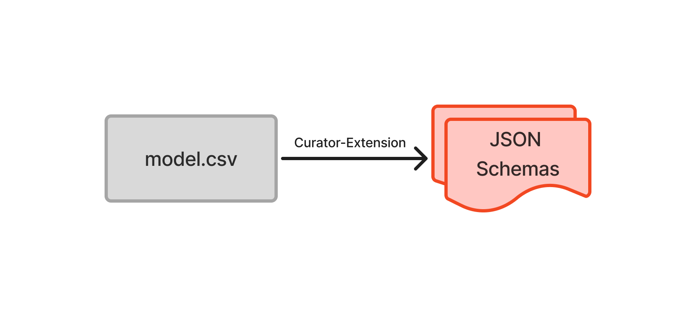
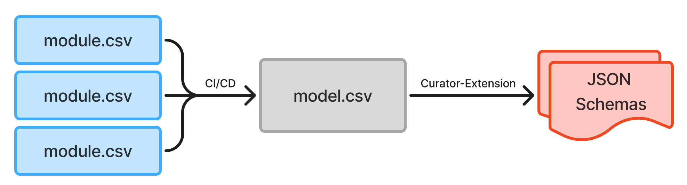
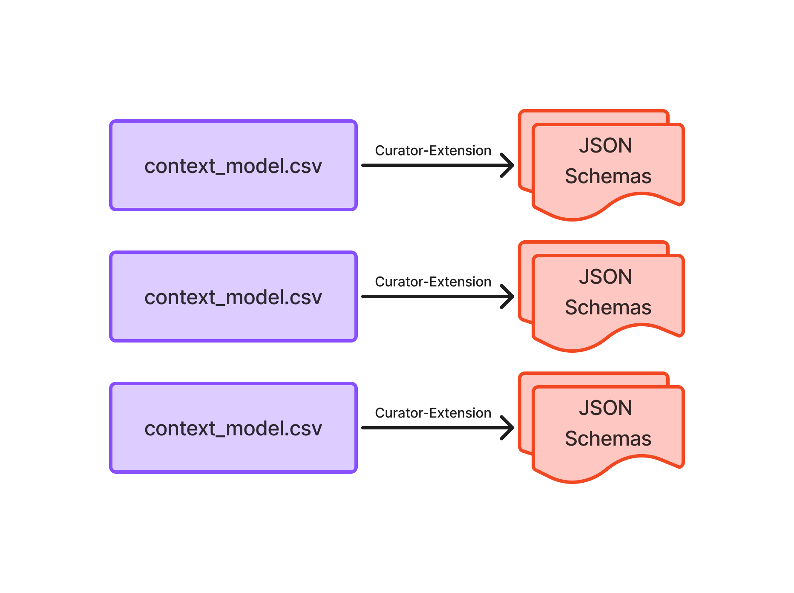

# Data Models

> [!IMPORTANT]
> The default branch has been converted to `tyu-refresh`, but the content is still under review https://github.com/Sage-Bionetworks/data-models/pull/43.  Once this PR is merged, the default branch will be converted back to `main`.  Feedback would be greatly appreciated.

The Curator-Extension (formerly Schematic) data model is used to create JSON Schemas for 
[Curator to enable the contribution of valid metadata](https://docs.synapse.org/synapse-docs/managing-metadata-with-curator). See [JSON Schema documentation](https://json-schema.org/). 
This can be used by those that prefer working in a tabular format (CSV) over JSON 
or LinkML. A data model is created in the format specified [here](https://python-docs.synapse.org/en/latest/explanations/curator_data_model/) 
and a working example CSV is available at [example.model.csv](./one_csv/example.model.csv). 

The Curator-Extension in the Synapse Python Client can be used to convert to JSON Schema.

# Data Model Design

The Curator-Extension data model format can be leveraged to support a variety of data model 
design needs, particularly when accessory scripts and CI/CD workflows are utilized. 
Below we describe three different approaches known to be used by Sage Bionetworks 
teams. If your use case is not well supported with one of these designs please 
submit a issue and our team will be happy to work with you to find a solution.

1. Single CSV
1. Modular CSV
1. Contextualized CSV

## Single CSV

Most data models will start here, as a single CSV file containing all data model 
attributes and template/schema definitions. 



Is best for
- data models with a limited number of attribute and schema definitions
- when little-to-no use of conditional attribute behavior is needed (or when 
conditional attribute behavior is only defined for attributes with limited use across 
templates/schema)

## Modular CSV

As a data model gets larger it can become overwhelming to maintain as a single CSV, 
particularly when it comes to manual revisions to the CSV file. Using a modular 
approach, where data model attributes and schema definitions are split up 
across multiple CSV files can alleviate this challenge. The [modules](./modules) folder 
contain an example of how the [example.model.csv](./example.model.csv) can be 
broken down into modules.



Is best for
- large data models with many attributes. The tipping point for when a modular 
approach is needed will vary, but typically models with > 100 attributes may be easier 
to manage with this approach.
- when little-to-no use of conditional attribute behavior is needed (or when 
conditional attribute behavior is only defined for attributes with limited use across 
templates/schema).

CI/CD workflows are then used to concatenated each module into a single model CSV 
from which JSON schema are derived. With this approach it will be critical to have 
a well defined data model maintenance and development process and robust QC review 
process to ensure work is not duplicated or overwritten upon module concatenation.

Some examples of modular data models include [eliteportal/data-models](https://github.com/eliteportal/data-models) 
and [mc2-center/data-models](https://github.com/mc2-center/data-models).

## Contextualized CSV

The contextualized data model design enables greater flexibility in data model schema 
design and behavior at the expense of more complex data model maintenance and development 
processes. In this design there are >1 standalone model CSV files, each of which defines 
one or more schemas. Each standalone CSV is a complete model scoped and designed for a 
specific context.

Though there are parallels between modular and contextualized data model designs in that 
both have multiple CSVs, these approaches differ in that modular data models are 
designed to be concatenated into a single model CSV, while each contextualized CSV 
is designed to be used independently to generate JSON schemas for a specific context.



Best for
- when a data model has attributes with conditional behavior, particularly when 
that conditional behavior is only desired for specific schemas or 'contexts'.
- when context-specific valid values (aka enums) are desired for improved user experience in Curator.

With this approach it will be critical to have a well defined data model maintenance 
and development process and robust QC and testing process to ensure the derived 
JSON schema meet expectations.

There are potentially different ways that data models can build out a contextualized 
data model design which hypothetically could also include a modular approach as well.
CI/CD workflows will be critical for this approach. 

A demo example an be found here in the [contexts](./contexts/) folder where each context 
is it's own CSV. An in-production example is 
[ARK-Portal/data_model](https://github.com/ARK-Portal/data_model).

---

# Descriptions of valid values

The "Valid Values" column for attributes often contain many values without any descriptions. In this scenario, you can add descriptions to these valid values by adding extra rows and having these valid values appear as "Attributes".

> [!CAUTION]
> When adding valid value as an Attirbute to add a description of the valid value, it CANNOT appear in any string value in the "DependsOn" column unless you wanted it to be a data model attribute as well.

---

# Using this template repository

1. Decide on the way you want to organize and maintain your data model (three options above)
1. Keep the desired folder (one_csv, modules, contexts) and delete the other two
1. Keep the corresponding GitHub Action [onecsv-ci.yml](./github/workflows/onecsv-ci.yml), [modules-ci.yml](./github/workflows/modules-ci.yml), and [contexts-ci.yml](./github/workflows/contexts-ci.yml) and delete the other two. Consider renaming the file to `ci.yml` for simplicity.

---

# Manually Generating JSON schemas

To manually generate jsonschemas, you are required to install the Synapse Python Client along with the curation extension. Each of the data model options above will have slightly different methods of generating JSON schemas.

> [!NOTE]
> This section assumes that you already have working proficiency with Python.

```
pip install "synapseclient[curator]"
```

## One CSV

Generate all data model jsonschemas from one CSV.

```
synapse generate-json-schema one_csv/example.model.csv --data-model-labels display_label
```

## Modular CSV

Concatenate all CSVs and generate all data model jsonschemas from the assembled CSV.

```
python scripts/assemble_csv_data_model.py modules assembled.csv
synapse generate-json-schema assembled.csv --data-model-labels display_label
```

## Contextualized CSV

Generate a jsonschema from each data model CSV.

```
synapse generate-json-schema contexts/clinical_model.csv --data-model-labels display_label
synapse generate-json-schema contexts/genomic_model.csv --data-model-labels display_label
```

---

# Best Practices: Operations for Data Models

## Purpose

This describes operational best practices for:

1. Ensuring day-to-day data model edits reliably produce JSON Schemas that work with Synapse Curator.
2. Creating official, versioned JSON Schema releases registered in Synapse.
3. Maintaining clear separation between **test (development)** and **production (released)** schema environments.

This guidance focuses on governance, change management, and release discipline.

---

## Guiding Principles

1. Data models require ownership, review, and lifecycle management.
1. Schemas used in production must be immutable.
1. Development and production environments should be separated. It is encouraged to have a development environment.
1. Portals own their data models.

---

## Environment Separation: Recommended Organizational Structure

Each portal is recommended to maintain **two separate Synapse schema organizations**.


### Test Schema Organization (Development)

**Purpose**

- Rapid iteration
- Curator compatibility testing
- Pre-release schema staging

**Characteristics**

- Schemas may change frequently.
- Versions may be overwritten.
- Clearly labeled as **non-production**.

**Recommended naming conventions**

- `test.sage.{portal_name}`

### Production Schema Organization (Released)

**Purpose**

- Official, versioned schema releases
- Stable references for Curator

**Characteristics**

- Schemas are immutable once released.
- Organized by version.
- Ideally never overwritten.

**Recommended naming conventions**

- `sage.schemas.{portal_name}`
- `org.synapse.{portal_name}`

---

## Daily Model Edits (Test Environment)

Ensure routine data model changes work with Synapse Curator and remain aligned with operational expectations.

### Every change should generate JSON Schemas

No model change is considered complete until JSON schemas are able to be generated and registered into the Test Schema Organization to ensure Synapse Curator compliance.

---

## Official Schema Releases (Production)

Create reproducible, traceable, immutable schema releases registered in Synapse.

### Schemas are versioned using explicit release numbers

Recommended: **Semantic Versioning**

- **MAJOR** – breaking changes
- **MINOR** – backward-compatible additions
- **PATCH** – non-breaking fixes

Versioning applies to the release set, not individual ad hoc files.

### Production releases must be immutable

Once a schema version is registered in the Production Schema Organization, it should never be modified. Corrections to the schema require a new version.

### Formal Release Process

Each portal should define a lightweight but explicit release process of their data model to

1. Confirm all changes can create Synapse compliant JSON schemas
1. Ability to create release artifacts within GitHub (e.g. use GitHub Release + tag feature)
1. Generate and register versioned JSONschemas to production JSONschema organization

---

# Using GitHub Actions

This repository also contains [template github actions](.github/workflows/ci.yml) that will generate jsonschemas from each of the recommended data model maintenance approaches.  These github action workflows lightly implement the what was described in the "Best Practices: Operations for Data Models" section above but Sage Portal Owners do NOT have to use these workflows to achieve the best practices.

## Avoiding Merge Conflicts with Automated Commits

**Try to avoid** configuring GitHub Actions to commit generated files (like assembled CSVs or JSON schemas) back to the repository. This practice commonly leads to merge conflicts and complicates collaborative workflows.

### Problems with automated commits:
- Creates merge conflicts when multiple contributors work simultaneously
- Makes git history noisy with automated commits
- Complicates branch management and pull request reviews
- Can cause infinite loops if not properly configured

### Recommended alternative: Use GitHub Artifacts

Store generated files as build artifacts that can be downloaded

```yaml
- name: Upload assembled CSV
  uses: actions/upload-artifact@v6
  with:
    name: assembled-data-model
    path: assembled.csv
```

This approach keeps your repository clean while still providing access to generated files for downstream consumers and for github tagged releases, it will retain the artifact "forever"
